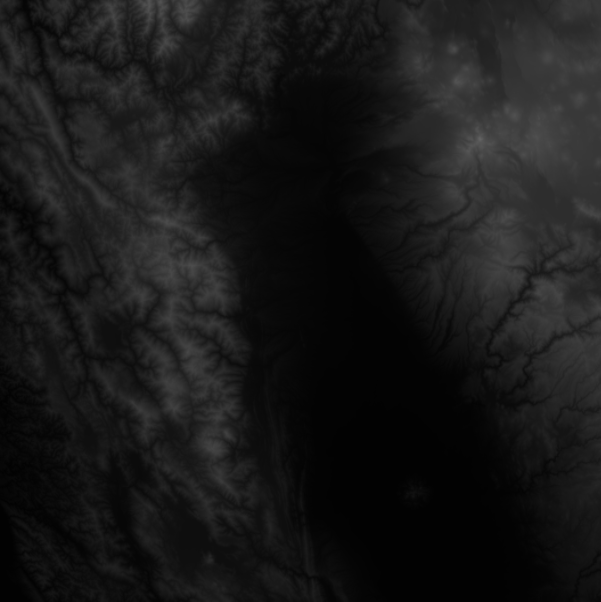

Jaanga Terrain DE15 Read Me
===========================

Digital elevation heightmaps in 16,384 PNG files to an accuracy of fifteen seconds or about 500 meter resolution

Data sourced from Jonathan de Ferranti's [Viewfinder Panorama]( http://www.viewfinderpanoramas.org/Coverage%20map%20viewfinderpanoramas_org15.htm )

Live demo: [Hello World]( http://jaanga.github.io/terrain-viewer/hello-world/r1/hello-world.html )

* Jonathan de Ferranti's 15 second data set in 16,384 PNG files organized in the Open Street Map way
* About one data point about every 500 meters
* Data set covers the entire globe
* Approx 836 MB of data

Several viewer apps are available from the [Jaanga Terrain Viewer]( https://github.com/jaanga/terrain-viewer ) repository.

## Project Files
You have two ways of viewing the Jaanga Terrain DE15 files:

* GitHub Pages view: [jaanga.github.io/terrain]( http://jaanga.github.io/terrain-de15/ "view the files as apps." ) <input value="<< You are now probably here." size=28 style="font:bold 12pt monospace;border-width:0;" >  
* GitHub Source Code view: [github.com/jaanga/terrain]( https://github.com/jaanga/terrain-de15/ "View the files as source code." ) <scan style=display:none ><< You are now probably here.</scan>
